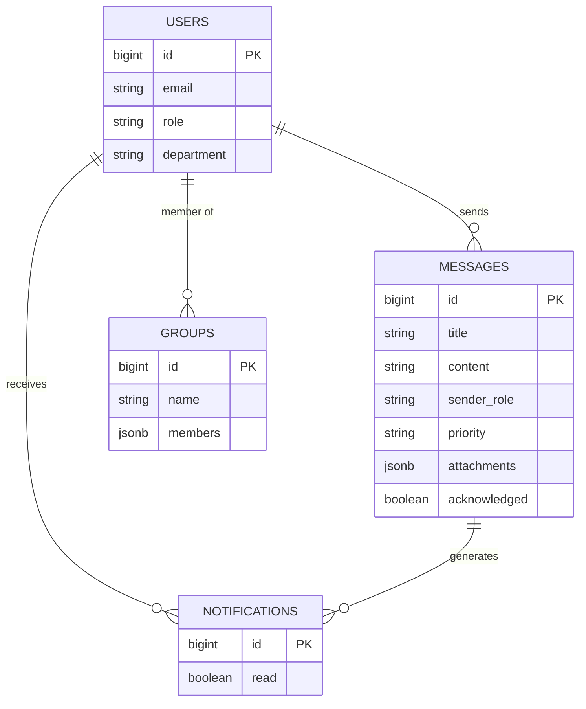

# Buzzify - Campus Messaging Portal
## College Project Report

### Abstract
Buzzify is a comprehensive campus communication management system designed to streamline information flow between administrators, staff, and students. In modern educational institutions, effective communication is crucial but often fragmented across multiple platforms. Buzzify solves this by providing a unified, role-based web portal where messages can be prioritized, targeted to specific groups, and tracked for acknowledgement. This project leverages modern web technologies including Next.js, React, and Supabase to deliver a responsive, real-time messaging experience.

### Introduction
Communication in large educational campuses is often chaotic, relying on notice boards, disjointed emails, and verbal announcements. Buzzify introduces a digital transformation to this process. It is a full-stack web application that serves as a central hub for all official campus communications. The platform distinguishes between different user roles—Admins, Staff, and Students—ensuring that the right information reaches the right people efficiently.

### Background and Motivation
The primary motivation behind Buzzify was the observation of inefficient communication channels in college environments. Important announcements often get lost in spam folders or missed on physical notice boards. There was a clear need for a dedicated system that guarantees delivery of high-priority messages and allows for easy segmentation of recipients, such as sending alerts specifically to "All Staff" or "Computer Science Students." Furthermore, the system addresses the need for feedback by providing senders with information on who has read or acknowledged a message.

### Problem Statement
Existing communication methods in educational institutions suffer from several critical issues. Information is often scattered across emails, WhatsApp groups, and physical notice boards, leading to a lack of centralization. There is typically no accountability, as senders cannot verify if recipients have seen important notices. Students frequently face information overload, receiving irrelevant messages meant for other departments. Additionally, creating distribution lists for specific batches or departments is often a manual and error-prone process.

### Objectives
The main objectives of the Buzzify project are to develop a role-based authentication system that ensures secure access for all users. The project aims to implement a flexible messaging system that supports priority levels (Low, Medium, High) and scheduling capabilities. Another key objective is to create a targeted delivery system using dynamic user groups, ensuring messages reach the correct audience. The system also seeks to provide an acknowledgement mechanism for critical updates and offer a real-time dashboard for tracking message reach and engagement.

### Scope of the Project
The scope of this project encompasses the development of a responsive web application accessible on both desktop and mobile devices. It includes the implementation of three distinct user roles: Admin, who has full system control and can manage users and broadcast messages; Staff, who can send department-level messages and manage students; and Student, who can view messages, acknowledge receipt, and manage their profile. The features developed include Login and Authentication, a Dashboard, Message Creation, a Notification Feed, and an Admin Panel. This version of the project does not include native mobile applications for iOS or Android, nor does it integrate with external SMS gateways.

### Expected Outcome
The expected outcome is a fully functional web portal that is deployed and accessible to users. The implementation of this system is anticipated to lead to a significant reduction in missed deadlines and overlooked announcements among students. It will also result in a streamlined administrative workflow for broadcasting circulars and provide a reliable digital record of all campus communications.

### System Design and Planning
The project followed an Agile development methodology, broken down into several sprints. The process began with Planning, which involved requirement gathering and schema design. This was followed by the Design phase, where UI/UX prototyping was done using shadcn/ui components. The Development phase focused on core feature implementation, including Authentication, Database, and API integration. Testing involved both unit testing and user acceptance testing. Finally, the Deployment phase covered hosting and final configuration.

### Requirement Analysis
Requirements were gathered by analyzing the specific needs of potential users. Admins require control and oversight over the entire system. Staff members need efficient ways to communicate specifically with their classes. Students require a clutter-free feed that displays only relevant information.

### Functional Requirements
The system requires users to authenticate by logging in with an email, password, and a specific role. For message management, users must be able to compose messages with a title, content, and priority level, as well as attach files like PDFs and images. The system must support scheduling messages for future delivery. Users need to be able to select recipients from options such as "All," "Students," "Staff," or custom groups. A dashboard is required to view the latest messages, unread counts, and statistics. Finally, an acknowledgement feature is necessary for students to confirm receipt of important messages.

### Non-Functional Requirements
The application must be performant, loading the dashboard in under two seconds. It needs to be scalable, capable of handling thousands of messages and users. Security is paramount; passwords must be hashed, and API access must be restricted by Row Level Security (RLS). The interface should be usable and intuitive, supporting features like Dark Mode to reduce eye strain.

### User Stories / Use Cases
An Admin user wants to create a "High Priority" message for all students to inform them about a sudden holiday. A Staff Member needs to see who has acknowledged an assignment notification to follow up with those who haven't. A Student wants to filter messages by the "Exam" category to easily find the schedule. A general User wants to toggle Dark Mode to improve viewing comfort at night.

### System Architecture
Buzzify utilizes a modern Client-Server Architecture. The Client is a Next.js (React) application running in the browser, handling the UI, state management via Zustand, and user interactions. The Server is provided by Supabase, a Backend-as-a-Service platform that hosts the PostgreSQL database, handles Authentication, and manages Real-time subscriptions. The API Layer consists of the Next.js App Router and the Supabase Client SDK, which manage data fetching and mutations.

### System Components
The system comprises several key components. The Frontend UI is built with React components and styled using Tailwind CSS and shadcn/ui. The State Store, located in `lib/store.ts`, uses Zustand to manage global state such as the current user, messages, and notifications. The Database is a PostgreSQL instance hosted on Supabase. The Auth Service is handled by Supabase Auth, which manages sessions and security.

### Data Flow
The data flow begins when a user fills out the "Create Message" form. The component updates local state variables with the input data. Upon submission, the `addMessage` action is dispatched to the Zustand store. The store then uses the Supabase client to execute an `INSERT` command into the `messages` table. Once Supabase confirms the save, the store updates the local `messages` array, and the UI re-renders to display the new message in the feed.

### Technology Stack
The application is built using Next.js 15 (React 18) as the frontend framework, with TypeScript as the primary programming language. Styling is handled by Tailwind CSS, utilizing shadcn/ui for components and Lucide React for icons. State management is powered by Zustand. The backend and database services are provided by Supabase (PostgreSQL). Version control is managed using Git and GitHub.

### Data Design
The database consists of relational tables designed to ensure integrity and efficiency. The `users` table stores profile and role information. The `messages` table contains the content, sender details, and delivery settings. The `groups` table manages custom distribution lists. The `notifications` table tracks individual user alerts.

### ER Diagram


### Flow Chart (Message Creation)
```mermaid
flowchart TD
    A[Start] --> B[User Clicks 'Create Message']
    B --> C{Is User Admin/Staff?}
    C -- No --> D[Access Denied]
    C -- Yes --> E[Fill Message Details]
    E --> F[Select Recipients]
    F --> G[Select Priority & Schedule]
    G --> H[Attach Files (Optional)]
    H --> I[Submit Form]
    I --> J{Validation Pass?}
    J -- No --> E
    J -- Yes --> K[Save to Database]
    K --> L[Trigger Notifications]
    L --> M[End]
```

### Code Implementation (Week 2)
*Focus: The Core Message Creation Logic*

The following code snippet from `create-message.tsx` demonstrates the core logic for handling form submission. It validates the user input, calculates the total number of recipients based on the selected criteria (such as "all" or "students"), constructs the message data object, and dispatches the `addMessage` action to the store.

```typescript
// app/dashboard/components/create-message.tsx

const handleSubmit = async (e: React.FormEvent) => {
  e.preventDefault()
  // Basic Validation
  if (!currentUser || !formData.title.trim() || !formData.content.trim()) return

  setIsSubmitting(true)
  try {
    // Calculate total recipients based on selection
    let recipientUsers: any[] = []
    let totalRecipients = 0

    if (formData.recipients === 'all') {
      recipientUsers = users.filter(u => u.id !== currentUser.id)
      totalRecipients = recipientUsers.length
    } else if (formData.recipients === 'students') {
      recipientUsers = users.filter(u => u.role === 'student')
      totalRecipients = recipientUsers.length
    }
    // ... (other logic for staff/admins)

    const messageData = {
      title: formData.title,
      content: formData.content,
      sender: currentUser.name,
      sender_role: currentUser.role,
      recipients: formData.recipients,
      priority: formData.priority,
      attachments: attachments,
      schedule_type: formData.scheduleType,
      total_recipients: totalRecipients,
      read_count: 0,
      acknowledged: false,
    }

    // Call Store Action
    await addMessage(messageData)
    setIsSubmitting(false)
    onSuccess()
  } catch (error) {
    console.error('Failed to send message:', error)
    setIsSubmitting(false)
  }
}
```

### Output Screens
The application features several key screens. The Login Screen presents a clean, centered card with role selection buttons for Admin, Staff, and Student, along with Email and Password fields and a "Demo Accounts" section for quick testing; it features a gradient background that adapts to the theme. The Dashboard serves as the main landing page, displaying a sidebar for navigation, a header with notifications, and a main content area that shows the Message Feed. The Create Message Modal offers a tabbed interface for Message details, Recipients, Schedule, and Attachments, allowing senders to compose rich messages while viewing a live preview pane on the right side.

### Login Page Validation
The login page, located at `app/page.tsx`, incorporates strict validation logic to ensure data integrity before attempting authentication. This logic checks that a user role is selected and that neither the email nor the password fields are empty. It validates the email format using a regular expression to ensure it adheres to standard email structure. Additionally, it enforces a minimum password length of six characters to maintain security standards.

**Code Snippet:**
```typescript
// app/page.tsx

// Email format validation
const emailRegex = /^[^\s@]+@[^\s@]+\.[^\s@]+$/
if (!emailRegex.test(email)) {
  setError('Please enter a valid email address')
  setLoading(false)
  return
}

// Password length validation
if (password.length < 6) {
  setError('Password must be at least 6 characters long')
  setLoading(false)
  return
}
```

### Implementation Plan
The project implementation is divided into four weeks. Week 1 focuses on Setup and Authentication, which involves initializing the Next.js project, configuring Tailwind CSS, setting up the Supabase project, and implementing the Login page with validation. Week 2 is dedicated to Core Messaging, including the creation of database tables, implementation of the `CreateMessage` component, and building the `MessageFeed` to display messages. Week 3 covers Advanced Features, adding capabilities for file attachments, scheduling logic, and the acknowledgement system. Finally, Week 4 is reserved for the Admin Panel and Polish, building user management features, implementing Dark Mode, and performing final testing.

### Conclusion
Buzzify successfully addresses the communication gaps identified in the problem statement. By leveraging modern web technologies, it provides a robust, scalable, and user-friendly platform for campus messaging. The system ensures that critical information reaches the intended audience promptly, with features like priority levels and acknowledgements adding a layer of accountability that was previously missing. Future enhancements could include mobile push notifications and SMS integration to further extend its reach.
